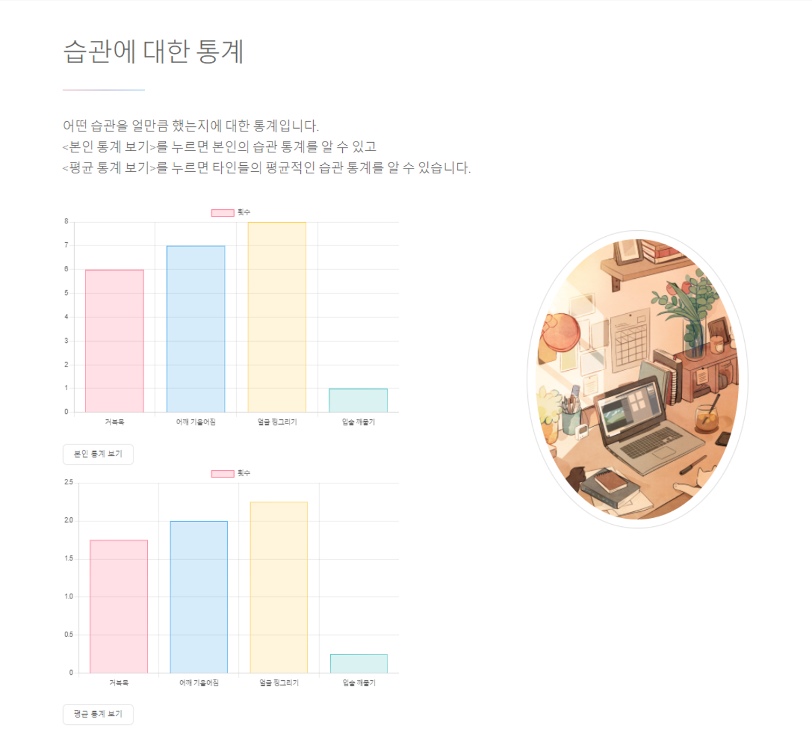

# Upright 1 Openpose version

 

## 프로젝트 주제
OpenPose 라이브러리를 이용한 자세 교정 프로그램

 
  
## 프로젝트 기간
| 구분 | 기간 |
| -- | -- |
| 전체 기간 | 2021.09.01 ~ 2021.12.13 |
| 실질 개발 | 2021.10.11 ~ 2021.12.13 |

 

## 팀원 소개
| 이름    | 역할         | 스택       | 기타                            |
|---------|--------------|------------|---------------------------------|
| 류준형   | 팀장, 웹페이지  | NodeJS  | 웹페이지 담당 및 데이터베이스      |
| 김건호   | App 백엔드   | Python, OpenCV  | 자세 알고리즘 및 데이터베이스 |
| 김서영   | App 백엔드   | Python, OpenCV  | 표정 인식 알고리즘           |
| 전동현   | App 프론트엔드   | PyQt        | PyQt 디자인 |

 

## 특이사항

실시간으로 자세 측정하는데 있어 컴퓨터 성능에 따라 지연 시간이 최대 3~4초까지 걸리는 현상이 발생했습니다. 그래서 소켓 통신 개념을 이용해 연산 처리를 서버 컴퓨터에서 처리하도록 만들었습니다.

### 클라이언트 소켓 연결

### 서버 소켓 연결

### 서버 소켓 닫기

### 실행 과정
다음과 같이 라이브러리 코드를 분리하여 서버 컴퓨터에서 연산이 처리되도록 하였습니다.

클라이언트 측에서 영상 데이터를 프레임 단위로 보내 서버 측에서 받습니다.

분리한 코드가 서버 컴퓨터에서 돌아가며 사진을 OpenPose 라이브러리로 판단합니다.

신체 위치를 추정하여 좌표값을 계산 후에 다시 클라이언트로 보냅니다.

### 결과
이렇게 연산 처리 부분을 분리하여 소켓 통신을 수행한 결과, 자세 추정이 컴퓨터 성능에 영향을 받지 않게 되었고 어느 컴퓨터에서나 실시간으로 자세 교정 프로그램을 실행시킬 수 있었습니다.

 

## 작동 흐름도

 

## 시스템 구성도

 

## 프로그램 화면
### 상단 컨트롤바

### 자세 교정

  

## 웹페이지 화면
### Upright 로고

### 사진 데이터

### 교정 사이트

### 통계 데이터

